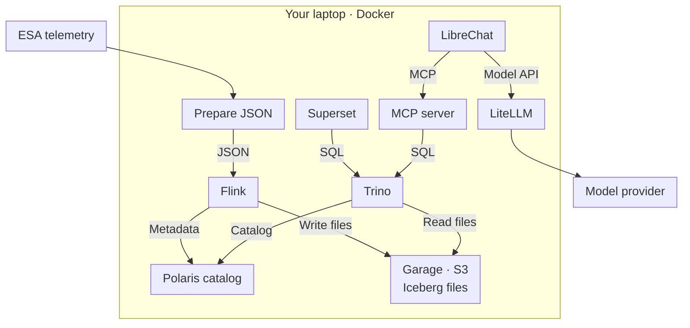

# Step 0 — Overview

In this three-hour workshop, we'll build a telemetry platform using open source
tools, then connect an LLM to it for analysis.

Sections use the format **step.section**; actions within a section add a third
number. If you need help, give the number and name, such as **1.4.2 — Prepare
the telemetry files**, along with the command or screen and any error message.

## 0.1 — Workshop architecture



## 0.2 — Workshop sequence

**Ingesting data with Flink (Step 1).**
Apache Flink reads the telemetry files and writes them into **Apache
Iceberg**, an open table format that manages Parquet files in object storage
with a schema, snapshots, and time travel. The files
live in **Garage**, a lightweight S3-compatible object store, and **Apache
Polaris** is the catalog: it tracks tables and the location of their current
metadata.

**Querying data with Trino (Step 2).**
**Trino** is a distributed SQL engine that reads Iceberg natively. Anything
that connects to Trino can analyze the telemetry. We'll use **Apache Superset**
to build charts and inspect Trino's query planner to understand how
Iceberg's metadata makes queries fast (partition pruning, file skipping).

**Analyzing data with MCP tools (Steps 3–5).**
The **Model Context Protocol (MCP)** exposes tools to an LLM client. We'll run
**LibreChat** as the chat UI, route model calls through **LiteLLM** to the model
provider, and build an MCP server with **FastMCP** for querying the warehouse.
In Step 5, we'll combine query, anomaly-detection, and charting tools in an agent.

## 0.3 — The ESA dataset

We're using the [ESA Anomaly Dataset (ESA-ADB)](https://zenodo.org/records/15237121):
curated telemetry from three ESA missions, published in 2024 for anomaly-detection
research. It contains 224 channels of multi-year time series with labeled
anomalies.

The full download is ~11.6 GB (three mission archives). For the workshop we
use a ~150 MB subset — Mission1's metadata plus seven channels, pulled
from the archive with HTTP range requests (see `task data:download`). The subset
uses the same schema as the full dataset. You can also run each step against a
full mission at home
(`task data:download -- medium`).

## 0.4 — Set up your laptop

### 0.4.1 — Check prerequisites

You need Docker with Compose v2, [Task](https://taskfile.dev), about 8 GB of RAM
available to Docker, and a few GB of free disk space. Your instructor will
provide credentials for OpenAI LLM access in Steps 3–5.

### 0.4.2 — Create the local configuration

From the repository directory, run:

```bash
task setup            # creates .env from the template + local data dirs
```

You can continue with the data steps now. You'll add the workshop credentials
to `.env` in [3.3.1 — Enter the workshop key](03-chat.md#331--enter-the-workshop-key).

### 0.4.3 — Download the workshop dataset

On the conference network, set `DATA_MIRROR=<url>` in `.env` using the URL from
your instructor. Then run:

```bash
task data:download    # ~150 MB workshop subset of the ESA dataset
```

### 0.4.4 — Open the workshop guide

```bash
task up:docs          # service links + these docs at :4321
```

Open [http://localhost:4321](http://localhost:4321). The service links become
available as you start each step's services.

## 0.5 — Running services and restoring a checkpoint

- `task up` starts the services in Docker Compose.
- The stack uses simplified authentication for local workshop use.
- To skip the ingest, use `task checkpoint:restore -- <name>` to restore a
  pre-built warehouse, including the Iceberg files and the Polaris catalog.
  Your instructor will provide the checkpoint names.

## 0.6 — Resolve a host-port conflict

### 0.6.1 — Find the container using the port

If Docker reports `port is already allocated`, another process or container
already uses that port. List the running containers and their published ports:

```bash
docker ps --format 'table {{.Names}}\t{{.Ports}}'
```

### 0.6.2 — Stop the older workshop stack

An older copy of the workshop may occupy several ports, including `4321` for
the guide. If you no longer need that copy, run `task down` from its repository
directory, then retry `task up` here. `task down` preserves the data volumes.

If the older stack was started with a custom Compose project name (`-p`), use
that same name when stopping it. For example, from the older repository:

```bash
docker compose -p tm-workshop-upgrade down
```

### 0.6.3 — Restore a missing port binding

If a container starts after the conflict is resolved but its host port is still
missing from `docker compose ps`, recreate that service. For the guide:

```bash
docker compose up -d --force-recreate docs
```

Next: [Step 1 — Ingesting data into Iceberg](01-ingest.md)
